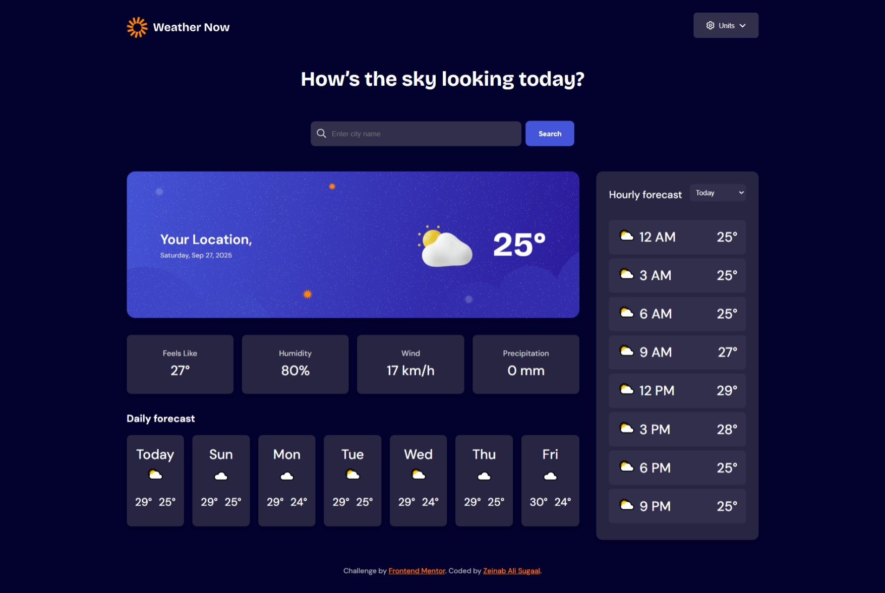

# Weather App

This is a solution to the [Weather App challenge on Frontend Mentor](https://www.frontendmentor.io/challenges/weather-app-Rt39fZEGL). Frontend Mentor challenges help you improve your coding skills by building realistic projects.

## Table of Contents

- [Weather App](#weather-app)
  - [Table of Contents](#table-of-contents)
  - [Overview](#overview)
    - [The Challenge](#the-challenge)
    - [Screenshot](#screenshot)
    - [Links](#links)
  - [My Process](#my-process)
    - [Built With](#built-with)
    - [What I Learned](#what-i-learned)
    - [Continued Development](#continued-development)
  - [Author](#author)
  - [Acknowledgments](#acknowledgments)

## Overview

### The Challenge

Users should be able to:

- Search for weather information by entering a location in the search bar
- View current weather conditions including temperature, weather icon, and location details
- See additional weather metrics like "feels like" temperature, humidity percentage, wind speed, and precipitation amounts
- Browse a 7-day weather forecast with daily high/low temperatures and weather icons
- View an hourly forecast showing temperature changes throughout the day
- Switch between different days of the week using the day selector in the hourly forecast section
- Toggle between Imperial and Metric measurement units
- View the optimal layout for the interface depending on their device's screen size
- See hover and focus states for all interactive elements on the page

### Screenshot

### Links

- **Solution URL:** [https://github.com/Sweetysugaal/Frontend-Weather-app](https://github.com/Sweetysugaal/Frontend-Weather-app)
- **Live Site URL:** [https://frontend-weather-app-five.vercel.app/]

> **Note:** Replace the URLs above with your actual deployed links from Vercel, Netlify, or GitHub Pages.

## My Process

### Built With

- Semantic HTML5 markup
- CSS custom properties (CSS variables)
- Flexbox
- CSS Grid
- Mobile-first workflow
- JavaScript (ES6+)
- [Open-Meteo API](https://open-meteo.com/) for weather data
- [Google Fonts](https://fonts.google.com/) for typography (DM Sans & Bricolage Grotesque)

### What I Learned

This project was a fantastic opportunity to work with a real-world API and manage asynchronous data flows. I learned how to:

- Integrate the Open-Meteo API to fetch current weather, daily forecasts, and hourly data.
- Handle geolocation to provide a personalized experience for users.
- Implement a robust unit conversion system for temperature, wind speed, and precipitation.
- Create a responsive layout that works seamlessly from mobile to desktop.
- Manage complex state in vanilla JavaScript without a framework.
- Use CSS Grid and Flexbox together to create a modern, card-based UI.

The most challenging part was ensuring the hourly forecast correctly updated when a user selected a different day from the dropdown. I solved this by storing the full hourly dataset and filtering it based on the selected day index.

### Continued Development

In the future, I'd like to add the following features:

- A "My Location" button for quick access to the user's current weather.
- Local storage to remember the user's preferred unit system.
- Improved error handling for edge cases like invalid locations or API rate limits.
- An animated transition when switching between days in the hourly forecast.

## Author

- Frontend Mentor - [My-frontendmentor-profile](https://www.frontendmentor.io/profile/Sweetysugaal)
- Linked - [My-Linked](https://www.linkedin.com/in/zaynab-ali-a53660260/)

> **Note:** Update the links above with your personal information.

## Acknowledgments

I'm grateful to [Frontend Mentor](https://www.frontendmentor.io) for providing such well-designed and practical challenges. The community on Discord was also incredibly helpful when I got stuck.

This project uses data from the [Open-Meteo API](https://open-meteo.com/), a fantastic free service for non-commercial use.
